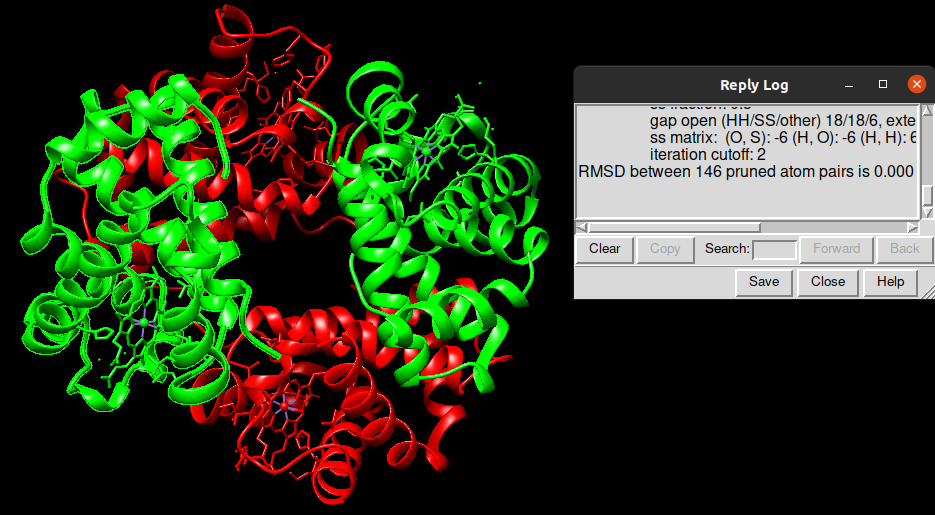
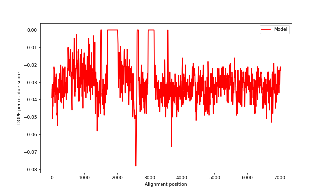
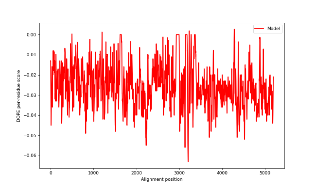
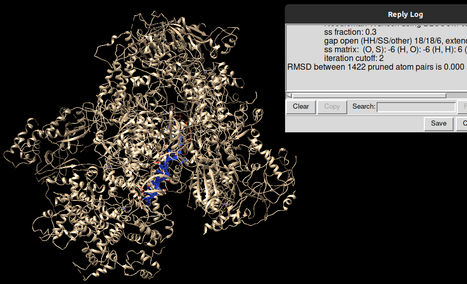

---
### BEGIN-Of-YAML-Block ###
#
## ######################################################################################
##
##   README.md
##
##     A LaTeX-extended MarkDown template for MScBI-ALG.
##
## ######################################################################################
##
##                 CopyLeft 2020 (CC:BY-NC-SA) --- Josep F Abril
##
##   This file should be considered under the Creative Commons BY-NC-SA License
##   (Attribution-Noncommercial-ShareAlike). The material is provided "AS IS", 
##   mainly for teaching purposes, and is distributed in the hope that it will
##   be useful, but WITHOUT ANY WARRANTY; without even the implied warranty
##   of MERCHANTABILITY or FITNESS FOR A PARTICULAR PURPOSE.
##
## ######################################################################################
#
# title-meta is title string without any LaTeX format to be used as pdftitle, part of emails subject...
title-meta: Macro-complex structure modeller
#
# title is the big title for the cover page, fully LaTeX formated to fit into a shortstack command...
title: |
  \textsc{Macro-complex structure modeller}
#subtitle:
#
# runtitle is the running header or footer, used i.e. by fancyheadings...
runtitle: |
  Macro-complex structure modeller
#
# author-meta sets the pdfauthor variable...
author-meta: !!str 'Aleix Canalda, Maria Díaz'
#
# authors to appear on the title page...
author:
- name: Aleix Canalda Baltrons
author:
- name: Maria Díaz Ros
#
# authorshort defines a brief list of authors, i.e. for headings
authorshort: YOURSURNAME, YOURNAMEshort
#
### end-Of-YAML-Block ###
---

# Introduction

We have developed a program to model the macro-complex structure of biomolecules, including proteins and DNA, using as an input the sequences of the pair interactions of the complex. This manual will include a tutorial explaining how to use the program using some examples, a theoretical explanation of the algorithm and the biological background behind it and, lastly, an analysis of the results of some examples, to assess the quality of the solutions our program offers.

# Tutorial

## Installation
...

## Command-line arguments

These are all the arguments that can be introduced to our program:

```{.sh}

  -h, --help            show this help message and exit

  -i INPUT_DIRECTORY, --input-directory INPUT_DIRECTORY
                        Directory containing the input PDB files

  -s STECHIOMETRY, --stechiometry STECHIOMETRY
                        Path to a file containing the stechiometry of the complex.

  -o OUTPUT_DIRECTORY, --output-directory OUTPUT_DIRECTORY
                        Directory where the output will be saved.

  -f, --force           Overwrite the content of the output directory.

  -v, --verbose         Print the progession of the execution.
  
  -e, --energy          Calculate DOPE energy and plot the result.
  
  -t --template-DNA     DNA template for models with only protein-DNA interactions.
   
  -m --models           Number of resulting models.
```

### Input (mandatory argument)

As we can see above, the input has to be a directory containing only PDB files. These files have to include two interacting chains from the model and the name of each file has to follow a set structure: name_chain1_chain2.pdb(.gz) where the name is an alphanumerical string and the chains must coincide with the IDs of the chains inside the file. As it can be seen, the PDB files can either be compressed or not.

### Stechiometry

The stechiometry file must contain a line for each chain and its associated number, such as:

A:2

B:2

### Output directory (mandatory argument)

If the directory doesn't exist, it will be created automatically but if the user introduces an already existing directory, it will raise an error unless he specifies that he wants to overwrite the content (using the -force argument).

### Template DNA
It is a mandatory argument when the model consists only of protein-DNA interactions that form a long strand of DNA where the proteins interact. The input is the path to a file containing the both strands of a DNA sequence as a PDB file.

## Examples


# Algorithm

The program starts by processing the arguments provided by the user that are, at the bare minimum, the required input and output directory. It performs a necessary check to ensure that all the files provided (whether the input or the stechiometry files) have the correct structure. Then, the program proceeds to create a list containing all the pair interactions corresponding to the input files. Nevertheless, the chains are saved as an object of a self-developed class that is a child of the Chain class of the Bio.PDB.Chain module created in order to include some extra functions that will useful throughout the program.

Once all the chains are included inside a list, the next step is discovering all the interactions among the chains (whether provided as an input file or not) and creating a dictionary with all the interacting chains. Afterwards, the starting model that will act as the core to start superimposing the chains has to be selected. The starting model for this program consists of two interacting chains that can be found in one of the input PDB files.  To decide the pair, first the chain with the largest number of interactions is chosen and then, using the interactions dictionary, it selects the second chain of the starting model. That way, the chosen starting model has a chain that is related to various other chains, making the process of adding all the chains and searching for interacting chains onto the structure much more efficient. Moreover, by doing so it can be avoided selecting a starting chain that doesn't present interactions at all. Once a starting model has been chosen, it's saved in an object of the class Model from the Bio.PDB.Module module and the following chains being added will be introduced inside this object.

At this point, the main loop of the program begins, going through all the interactions and trying we can superimpose one chain at a time using the interactions dictionary to find the interactions between the new chain being added and the chains already in the model in an iterative fashion. The program uses the Bio.PDB.Superimposer module to superimpose two identical subunits (chains that have at least 95% similarity), and along with them, their respective interacting chain, applying to the former the transformation matrix applied to the identical chains' superimposition. For instance, if the model contains an interaction (A-B) and the next chain (chain C in this example) has to be added, a pair of interacting chains is supplied (for example, A-C). Then the function will then be able to superimpose (A-A) in order to obtain the structure with the 3 chains as shown in Figure X.


Before adding the superimposed chain to the model, it has to be checked if it presents clashes with the rest of the model, in order to keep the chain or not add it at all. A function will calculate the amount of clashes using the Bio.PDB.NeighborSearch module, that analyzes if some of the atoms of two chains are too close to each other. If more than 5% of the atoms are at a distance shorter than 2 Armstrongs, it is considered a significant clash and the chain will not be added to the model. If this is the case, then the function will try to superimpose the current chain with other interactions until it can fit in without clashes. If the chain can not be introduced without clashes after trying with all possible interactions, the chain won't be added to the model. This loop will continue until all possible chains have been added to the model and once the final model is ready, it will be saved inside a PDB file that will be available inside the structures folder inside the output directory the user chose.

Lastly, there will be an assessment of the energy of the models if the user so wishes. This assessment of the models consists on the calculation of the DOPE energies of the models using modeller. This creates a profile file that contains the energy information for the whole model and, to make it more simple and visual for the user, the program creates an energy profile plot using Matplotlib. These two files can be found on the analysis folder inside the output directory indicated by the user.


# Biological background

Obtaining the structure of a protein has been done for some years now through experimental procedures such as X-ray crystallography, NMR spectroscopy and electron microscopy. This has enabled to create a Protein Database (PDB) where many protein structures are stored. Thanks to this we can advance in the field of Structural Bioinformatics and obtain for example information on pairs of interacting chains of a macrocomplex which would allow us to create macrocomplex structures, which is exactly what this program is about. These macrocomplex structures are also known as the quaternary structure, where tertiary structures interact with each other to form a larger structure.

It should also be noted that it isn't as easy to obtain the structures for all proteins. For example, transmembrane proteins are harder than soluble proteins, which means that in the PDB there is a certain bias on the different proteins that we can find there. Furthermore, it is also very expensive and time-consuming to obtain PPIs.That is why being able to predict certain interactions with a program like ours can be important to help fill this gap of knowledge.

Examples of interacting forces would be hydrogen bonds, disulfide bonds but also Van der Waals forces or electrostatic forces. Examples of macrocomplexes that present these interactions would be hemoglobin, enhanceosome DNA-Protein interactions, receptors located at the membrane, etc.

Here, we will talk about the biological background that the program needed in order to be developed. 

## Macrocomplexes 

When talking about proteins, we know that most don't interact on their own, they form macrocomplexes. The chains usually interact in a way that they keep the hydrophobic residues together and expose the rest of residues to the solvent in order to obtain a more favourable structure. When taking this into account, we know that chains aren't in space on their own, they interact with each other in order to form the whole structure. For this reason, in our program we determined whether two chains were interacting or not, without taking into account if they had a joint pdb file, in order to detect all interacting chains for the whole complex, without the need to have many pdb files. We determined that two chains were interacting if they formed hydrogen bonds, which would mean that their atoms are at a length of 3.5 A or less (Narayan et al., 2000).Therefore, by knowing the pairs of interactions among them in space, we can reconstruct the whole stucture. Knowing the structures of these macrocomplexes will further our knowledge of protein-protein interactions (PPIs) and the biochemical functions they partake. 

## Superimposition

As it was explained before, a superimposition is done when a pair of identical chains are superimposed, resulting in the addition of another chain to the model. Following the example in the previous section, the model could include the chains A-B and it currently has to add the A-C interaction.

To do a superimposition it's necessary to have two lists of atoms of the same length (in the current example, two chains A). One will be a fixed list of atoms and the other is the one that will be moving. It's also necessary to stress the importance of having the same length in both lists of atoms, because the function will move each atom of the moving list towards the pair atoms of the fixed list, therefore, the number of atoms must be the same.

The rotation of the moving list is done in such a way that the RMSD (Root Mean Square Deviation) between the pairs of atoms of the two lists is minimized. This rotation that the moving atoms have is encoded in a translation matrix that will be applied to chain C. The interaction between A and C is known and also the interaction between A and B, so when the translation matrix is applied to C, it will rotate the exact way that the chain A had to rotate to superimpose with the chain A of the model, therefore, chain C will be fitted into the model.

However, after doing a superimposition, a possibel interference between the new chain and the already created model/structure has to be taken into account. If the atoms between two different chains are closer than a normal interacting distance (around 3-3.5 A), it's considered a clash. To calculate the clashes, the model obtains the atoms corresponding to the backbone of the structure. In the case of proteins, it uses the CA carbon (alpha carbon) and in the case of DNA it uses the C1 carbon. If the backbone atoms are in contact with each other at a distance of less than 2 A and if these clashes happen in more than 5% of the structure (Batsanov, 2001).

## Strengths

* Our program is capable of fully forming protein macrocomplexes from an input of pairs of interacting chains in said macrocomplex.

* It is capable of forming macrocomplexes that contain both protein-protein interactions and protein-dna interactions, as well as using RNA data.

* It is able to compute different models for protein-dna interactions. With the correct input, protein-protein final macrocomplex doesn't vary so it doesn't need various models. 

* With the stechiometry input, the user decides if they want to limit the number of chains in a macrocomplex.

* Our program is able to calculate, if the user wishes, the DOPE energy of the protein and it gives an energy profile to see if the results are good, especially in those cases where RMSD calculation is not possible.

## Weaknesses

* The computational cost of our program increases linearly, so when working with big macro-complexes, the number of possible comparisons increases as the core structure of the macro-complex gets bigger and so does the computational time of the program.

* Our program is able to compute various protein-dna interactions (if the input files contain both dna chains) only when using a dna template.

* It is not able to compute macrocomplexes that have a series of protein-protein interactions and at the same time protein-dna interaction, but only when the input files contain both dna chains (in cases where the input files only have one dna chain, it is possible).

* When various fragments of a chain are given, our program does not complete the chain, but chooses randomly one fragment. 

# Analysis

With our program we are able to analyze the DOPE energy of each model that we create with the optional argument "-e, --energy" and we obtain an energy profile for each model that uses MODELLER to obtain it on a window of 13 residues. The DOPE energy can be seen on the terminal screen. An energy that is very negative overall means that a good model was produced, whereas the less negative the energy, the worse the model is, which makes it easy to compare and find the model that is more suitable. 

Another way to analyze the model is, in those cases where the complete structure is available for download in the PDB, by superimposing with a program such as Chimera the model obtained with the complete known structure. By doing so, we can obtain the RMSD from this superimposition, where the smaller it is, being 0.00 the smallest value, the better the model. In this case, an RMSD of 0.00 would mean that the model is identical to the complete structure, so the reconstruction of the macrocomplex has been done perfectly.

With our examples, we decided to analyze the models both ways:

* **1gzx**. This macrocomplex corresponds to the oxy T state of the hemoglobin, obtained when oxygen is bound to all four chains. The main stechiometry is A2B2, corresponding to the alpha and beta chains of the protein, however the chains in the example are presented as A, B, C, D. After running it through our program we obtained a perfect reconstruction, with an RMSD of 0.000 between the 146 pruned atom pairs. The DOPE score of the model is -71488.671875 and it has a good energy profile, as seen in Figures X and Y
  
  
* **6gmh**. This macrocomplex is the structure of an activated transcription complex Polymerase II. Its main stechiometry is a Hetero 20-mer, with 20 unique protein chains (with a global stechiometry of A1B1C1D1E1F1G1H1I1J1K1L1M1N1O1P1Q1R1S1T), and also 3 unique nucleic acid chains (2 DNA chains and 1 RNA), which are the chains that were available for our program. In this example it was also obtained an RMSD of 0.000 between the 1441 pruned atom pairs and a DOPE score of ... with a good profile as seen in Figures X and Y.
  
  
* **5nss**. This macrocomplex is the intermediate complex of the RNA polymerase-sigma54 holoenzyme with a promoter DNA and the transcription activator PspF. It's a hetero 12-mer with 6 unique nucleic protein chains (creating an A6B2C1D1E1F1 stechiometry) and 2 nucleic acid chains. It was obtained an RMSD of 0.000 between 1340 pruned atom pairs and a DOPE score of -408088.031250, with a profile as seen in the Figure below.
  
  
* **5fj8**. This macrocomplex is the yeast RNA polymerase III elongation complex. The global stechiometry is a Hetero 17-mer, containing 17 unique protein chains and 3 unique nucleic acid chains, one RNA and DNA molecules. The RSMD between the model and the complex is also 0.000 between 1422 pruned atoms pairs and the DOPE score -497916.468750, with the profile shown below in Figure Y.
  
  
  * **2O61**. -79804.953125


# References

Narayanan Eswar, C. Ramakrishnan, Deterministic features of side-chain main-chain hydrogen bonds in globular protein structures, Protein Engineering, Design and Selection, Volume 13, Issue 4, April 2000, Pages 227–238.

Batsanov S.S.; Van der Waals Raddi of Elements, Inorganic Materials, 2001.

```{.sh .numberlines startFrom="100"}
# 
pandoc -f $PDOCFLGS                          \
       --template=./template/readme.tex      \
       -t latex --natbib --listings          \
       --number-sections                     \
       --variable papersize:a4paper          \
       --variable toc=true                   \
       --variable lof=true                   \
       --variable lot=true                   \
       --variable geometry:margin=1.5cm      \
       --variable fontsize=10pt              \
       -o $RF.tex $RF.md;                    \
pdflatex $RF.tex; bibtex $RF; pdflatex $RF.tex;  pdflatex $RF.tex;
#
# --highlight-style pygments
# --highlight-style tango
# ...
```
