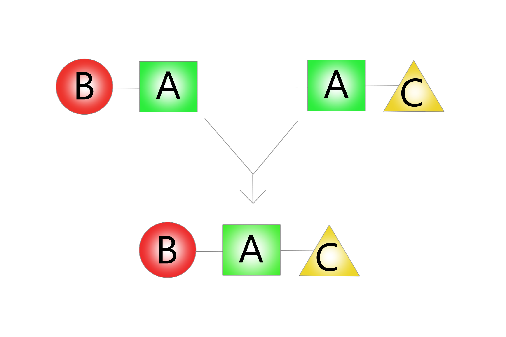
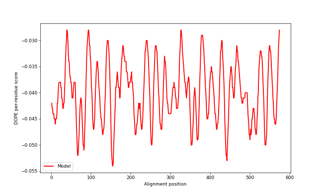
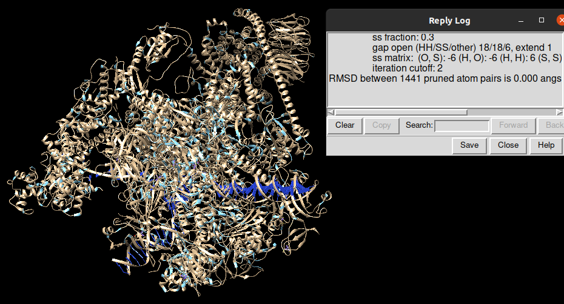
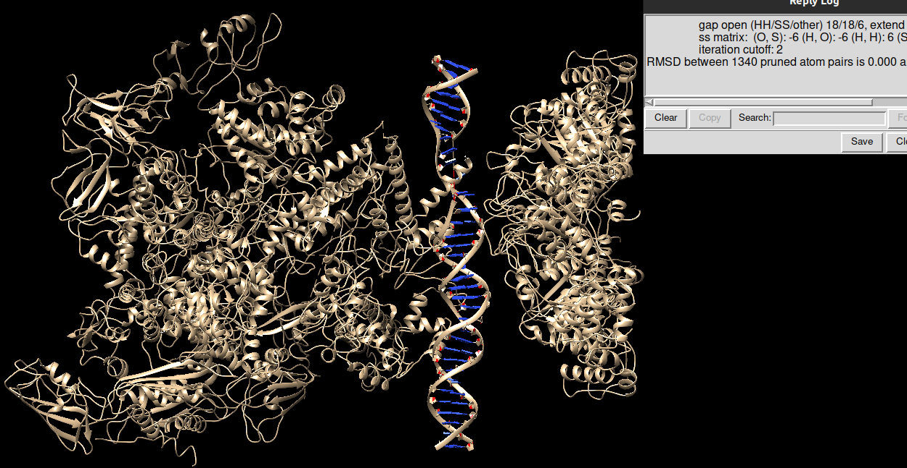
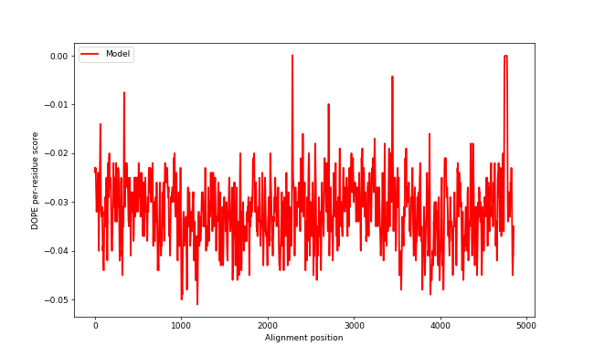
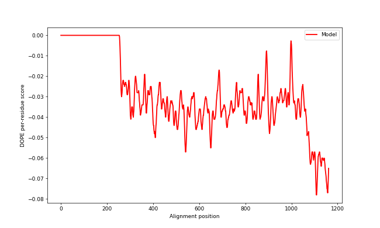
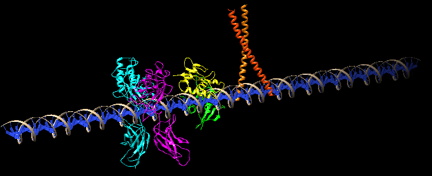
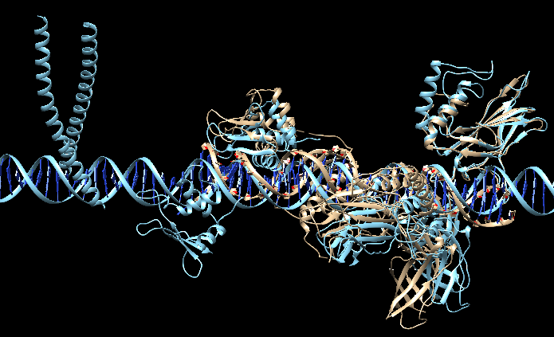

---
### BEGIN-Of-YAML-Block ###
#
## ######################################################################################
##
##   README.md
##
##     A LaTeX-extended MarkDown template for MScBI-ALG.
##
## ######################################################################################
##
##                 CopyLeft 2020 (CC:BY-NC-SA) --- Josep F Abril
##
##   This file should be considered under the Creative Commons BY-NC-SA License
##   (Attribution-Noncommercial-ShareAlike). The material is provided "AS IS", 
##   mainly for teaching purposes, and is distributed in the hope that it will
##   be useful, but WITHOUT ANY WARRANTY; without even the implied warranty
##   of MERCHANTABILITY or FITNESS FOR A PARTICULAR PURPOSE.
##
## ######################################################################################
#
# title-meta is title string without any LaTeX format to be used as pdftitle, part of emails subject...
title-meta: Macro-complex structure modeller
#
# title is the big title for the cover page, fully LaTeX formated to fit into a shortstack command...
title: |
  \textsc{Macro-complex structure modeller}
#subtitle:
#
# runtitle is the running header or footer, used i.e. by fancyheadings...
runtitle: |
  Macro-complex structure modeller
#
# author-meta sets the pdfauthor variable...
author-meta: !!str 'Aleix Canalda, Maria Díaz'
#
# authors to appear on the title page...
author:
- name: Aleix Canalda Baltrons
author:
- name: Maria Díaz Ros
#
# authorshort defines a brief list of authors, i.e. for headings
authorshort: YOURSURNAME, YOURNAMEshort
#
### end-Of-YAML-Block ###
---

# Introduction

We have developed a program called TheChosenModel to model the macro-complex structure of biomolecules, including proteins and DNA, using as an input the sequences of the pair interactions of the complex. This manual will include a tutorial explaining how to use the program using some examples, a theoretical explanation of the algorithm and the biological background behind it and, lastly, an analysis of the results of some examples, to assess the quality of the solutions our program offers.

# Tutorial

## Software Requirements

To be able to run the program smoothly and correctly, there are certain requirements that need to be met:

 * Python version 3.6

The following python modules:

 * Argparse

 * Biopython

 * re

 * random

 * gzip

 * os

 * sys

In order to run the -e --energy argument:

 * Modeller version 10.1

 * pylab

## Download and Installation

You can download the package to start its use with the following code:

```{.sh}

git clone https://github.com/aleixcanalda/TheChosenModel.git
cd TheChosenModel

```
There should be a script called setup.py with which we will do the installation. Nevertheless, before doing so, we should make sure that we have the requirements described above, otherwise the installation won't work.

```{.sh}

sudo python3 setup.py install

```
## Command-line arguments

These are all the arguments that can be introduced to our program:

```{.sh}

  -h, --help            show this help message and exit

  -i INPUT_DIRECTORY, --input-directory INPUT_DIRECTORY
                        Directory containing the input PDB files

  -s STECHIOMETRY, --stechiometry STECHIOMETRY
                        Path to a file containing the stechiometry of the complex.

  -o OUTPUT_DIRECTORY, --output-directory OUTPUT_DIRECTORY
                        Directory where the output will be saved.

  -f, --force           Overwrite the content of the output directory.

  -v, --verbose         Print the progession of the execution.
  
  -e, --energy          Calculate DOPE energy and plot the result.
  
  -t --template-DNA     DNA template for models with only protein-DNA interactions.
   
  -m --models           Number of resulting models.
```

### Input (mandatory argument)

As we can see above, the input has to be a directory containing only PDB files. These files have to include two interacting chains from the model and the name of each file has to follow a set structure. For protein-protein interactions the structure is: protein1_protein2.name_chain1_chain2.pdb(.gz) where protein1 is an alphanumerical string that will be used to identify the stechiometry of the structure, the name is an alphanumerical string (name of the complex) and the chains must coincide with the IDs of the chain IDs inside the file. As it can be seen, the PDB files can either be compressed or not. Additionally, there is the option of introducing input files with DNA interactions following this structure (when there is a combination of protei-protein and protein-DNA interactions). Then, instead of protein2 being any string, it will  put "DNA" to indicate that it's a DNA strand and chain2 will still be the chain ID inside the PDB file.

Example of input files for the protein macrocomplex 1GZX:

P69905_P68871.1gzx_A_B.pdb

P69905_P69905.1gzx_A_C.pdb

P69905_P68871.1gzx_A_D.pdb

For the cases with DNA-protein interactions exclusively (there are no protein-protein interactions) the structure is: protein.DNA.name_chain1_SenseAntisense.pdb(.gz). The protein is also an alphanumerical string that will be used to identify the stechiometry of the structure, then DNA to identify that it's a protein-DNA interaction and the name of the structure (name). Chain1 is the ID of the protein chain and it must coincide with the chain ID inside the file. SenseAntisense are the IDs of the two strands of DNA and they must coincide with the ID inside the file.

Example of input files for protein-DNA interactions (from the macro-complex 2O61):

P05412.DNA.1t2k_C_EF.pdb

Q04206.DNA.5u01_A_EF.pdb

### Stechiometry

The stechiometry is a .txt file that must contain a line for each protein using the same nomenclature used in the input files and it will indicate how many times the protein has to appear in the final model. Example of an stechiometry file:

P69905:2

P68871:2

### Output directory (mandatory argument)

If the directory doesn't exist, it will be created automatically but if the user introduces an already existing directory, it will raise an error unless he specifies that he wants to overwrite the content (using the -force argument).

### Energy
It calculates the DOPE score for each model and it builds a DOPE profile used to create a plot of the DOPE score along the sequence. To use this argument is necessary to have the modules of modeller and pylab installed.

### Template DNA
It is a mandatory argument when the model consists only of protein-DNA interactions that form a long strand of DNA where the proteins interact. The input is the path to a file containing the both strands of a DNA sequence as a PDB file.

## Examples

Our first example will be with the protein macro-complex of the oxy T state of haemoglobin, with the PDB ID **1GZX**. This is a structure made with X-ray diffraction with a resolution of 2.10 Å. The structure was deposited by the authors in 2002 from their paper about the T state haemoglobin (Paoli et al., 1996).

To create the complex running TheChosenModel in the terminal, the following code has to be executed:

```{.sh}

TheChosenModel.py -i home/examples/example1/1gzx/ -o home/examples/results/1gzx -f -v -e

```
With this line what we are doing is giving as input (-i) the path to a folder containing the pairs of chain interactions that will form the macro-complex 1GZX (correct naming structure explained in the input argument section), the path to the output folder where we want to store the results (-o) and, if this folder already exists, we'll overwrite it (-f). Also, we will show on the terminal the different steps that the program is going through, to keep track of the process, with the verbose argument (-v). And lastly, we will calculate the energies of the resulting model as well as its energy profile.

The final result of the model can be seen in the Analysis section of this document.

The other example we will show is the macro-complex with a PDB ID **2O61**. This complex is the crystal structure, obtained with X-ray diffraction, of NFkB, IRF7 and IRF3 bound to the interferon-b enhancer. The resolution of the complex is 2.80 Å and it was deposited into the database in 2006 by the authors of a paper about the activation of the interferon beta (IFN-beta) gene. Its activation requires an assembly of an enhanceosome containing ATF-2/c-Jun, IRF-3/IRF-7, and NFkappaB. (Panne et al., 2007)

This macro-complex is formed solely by DNA-protein interactions so, in order for the program to work, it is necessary to add a DNA template that will help with the superimposition process. The commands used to run the example are:

```{.sh}

TheChosenModel.py -i home/examples/example2/2O61/ -o home/examples/results/2O61 -t home/examples/example2/template_file.pdb -m 4 -e -s home/examples/example2/stechiometry_file.txt

```
With this line what we are doing is first giving as input (-i) the folder containing the chain interactions that will form the macro-complex 2O61 and the output folder where we want to store the results (-o). Also, we will send the template ("template_file") for the DNA (-t), we will receive four different models (-m 4) and calculate the DOPE energy for each of them. Lastly, the path to an stechiometry file is provided (-s, required syntax for the stechiometry explained in the stechiometry argument section) and the program will try to satisfy it the best it can. The final result of this model can be seen in the Analysis section of this document.

# Algorithm

In this section, the algorithm that the program uses will be explained step by step. The program starts by processing the arguments provided by the user which are, at the bare minimum, the required input and output directory. It performs a necessary check to ensure that both the input files and the stechiometry file (if provided) have the correct structure, otherwise it will raise the appropiate error. Then, the program uses a function called **all_chains** to create a list containing all the interactions corresponding to the input files. The interactions are saved in pairs in the case of proten-protein interactions and in trios in the case of protein-DNA interactions, where there are the two complementary strands of DNA to take into account. This function also creates a dictionary to keep the information of which protein each chain belongs to, which is going to be helpful in further steps. In both cases, the chains are saved as an object of a self-developed class (**MyChain**), that is a child of the Chain class of the Bio.PDB.Chain module, created in order to include some extra functions that will be useful throughout the program.

Once all the chains are included inside a list, the next step is discovering all the interactions among the chains (whether provided as an input file or not). This is done by a function called **get_interactions_dict** and it creates a dictionary with all the interacting chains. From here, the program will start the main function to generate the model and it diverges into two functions, depending on whether the user has provided a template DNA (**template_loop**) or not (**main_loop**). The two possibilities will be explained separately for better clarity in the following sections.

## Main_loop

This is the main function of the program when there is no template DNA and it builds the core of the model where the rest of the chains will be added on in an iterative fashion.

First of all, the function calls another function named **parse_stech** to extract information about the stechiometry file (if provided by the user) and save it in a dictionary. There are also some other dictionaries that will be created in order to control the stechiometry throughout the loop. Then, the starting model that will act as the core to start superimposing the chains and it will be selected thanks to the function **start_model**. The starting model will consist of an interacting pair of proteins that can be found in one of the input PDB files. To decide the pair, first the chain with the largest number of interactions is chosen and then, using the interactions dictionary previously created, the second chain of the starting model is selected. This way, it ensures that the chosen starting model has a chain interacting with various other chains, making the process of searching for interactions and adding the new chains onto the structure more efficient. Moreover, by doing so it can avoid the selection of a starting chain that doesn't present any interactions at all. Once a starting model has been chosen, it's saved in an object of the class Model from the Bio.PDB.Module module, where the following chains being added will be introduced inside this object.

At this point, the main loop of the program begins, going through all the interactions and trying to superimpose one chain at a time using the interactions dictionary to find the interactions between the new chain being added and the chains already in the model in an iterative fashion. When an interaction is found and the two chains necessary for the superimposition are located, first a function called **equal_length_chains** will check that the two chains have equal length (a mandatory requirement to do the superimposition). Then, the program uses a function called **superimpose** that employs the Bio.PDB.Superimposer module to superimpose two identical subunits (chains that have at least 95% similarity), and along with them, its respective interacting chain by applying to it the transformation matrix created with the superimposition of the two identical subunits. For instance, if the model contains an interaction (A-B) and then chain C has to be added, a pair of interacting chains is supplied (in this case, A-C). Then the function will be able to superimpose A-A, creating a transformation matrix that will be applied to C in order to obtain the structure with the 3 chains, as shown in Figure 1.



Before adding the superimposed chain to the model, the presence of clashes with the rest of the model has to be assessed, in order to decide whether to add the chain to the model or not. To that end, the **superimpose** function calls the function **clashes** to calculate the amount of clashes using the Bio.PDB.NeighborSearch module, that analyzes if some of the atoms of two chains are too close to each other. If more than 5% of the atoms are at a distance shorter than 2 Armstrongs, it is considered a clash and the chain will not be added to the model. If this is the case, then the function will try to superimpose the current chain using another one of its interactions and it will keep repeating until it can fit in the chain without clashes. If, after trying with all possible interactions, it can not be properly introduced, the chain won't be added to the model and the user will be made aware of it if the verbose argument was requested.

After this, the first iteration of the loop is finished and in the next iteration the process will start again with a new chain. Nevertheless, at the beginnig of each iteration, the stechiometry is checked. If the number of proteins in the model corresponding to the type of the current protein is already the number indicated in the stechiometry file, no more will be added and the loop will proceed to the next iteration.

## Template_loop

This function will be executed if the user has provided a template for the DNA. The function starts the same way as the **main_loop**, calling the **parse_stech** and the **start_model** functions. In this case, the **start_model** function will automatically use this template as a starting model and it will be introduced inside an object of the class Model. Here, to fit the protein onto the model, the fragment of the DNA that is interacting with the protein will be used. As it was mentioned before, the superimposition has to be done with two chains or strands of the same length, so the fragment of DNA can not be superimposed directly onto the template DNA. Therefore, the program uses clustal to align the the two DNA sequences and grab only the part of the template corresponding to the site interacting with the current protein being added. Once this is done, the program proceeds in a similar manner as the **main_loop**, using the **equal_length_chains** and the **superimpose** functions.

&nbsp;

Both of these main functions (main_loop or template_loop) will be called only once by default to obtain only one model, but if the user specifies the number of final models he wishes for, the functions will be called as many times as models are needed. After each model is finished, the function **save_PDB** will be called and it will create a file inside a folder called "structures" inside the output directory requested.

Lastly, there will be an assessment of the energy of the models if the user so indicates in the execution. This assessment is made by the function **DOPE_Energy** and it consists on the calculation of the DOPE energies of the models using modeller. This creates a profile file that contains the energy information for the whole model (named modelX.profile) and another file (named modelX.DOPE) where the standard output automatically created by the program is stored. This second file can contain some errors that are not to be noticed and at the end of it, the DOPE score is notated. Finally, to make it more simple and visual for the user, the program calls the function **get_profile**, that creates an energy profile plot using Matplotlib that is saved in a .png image. All the files created by this function can be found on the "analysis" folder inside the output directory indicated by the user.

## Analysis of the algorithm

This section is a discussion about the efficiency of the program and its cost. The part of the program that takes most time is the initial preparation. Before calling the main function, the program has to read and process all the input files one by one, creating new objects for each of them and introducing them inside some dictionaries and lists that will be used later on. This is the most costly step and the one that has the highest order of growth when the size of the input is increased. Fortunately, this preparation is only done once and then the actual building of the models is faster. Therefore, the growth of the algorithm regarding the number of models to create is linear, given that it is done using the main function in an iterative fashion (the main function is called as many times as models are needed).


# Biological background

Obtaining the structure of a protein has been done for some years now through experimental procedures such as X-ray crystallography, NMR spectroscopy and electron microscopy. This has enabled to create a Protein Database (PDB) where many protein structures are stored. Thanks to this we can advance in the field of Structural Bioinformatics and obtain for example information on pairs of interacting chains of a macrocomplex which would allow us to create macrocomplex structures, which is exactly what this program is about. These macrocomplex structures are also known as the quaternary structure, where tertiary structures interact with each other to form a larger structure.

It should also be noted that it isn't as easy to obtain the structures for all proteins. For example, transmembrane proteins are harder than soluble proteins, which means that in the PDB there is a certain bias on the different proteins that we can find there. Furthermore, it is also very expensive and time-consuming to obtain PPIs.That is why being able to predict certain interactions with a program like ours can be important to help fill this gap of knowledge.

Examples of interacting forces would be hydrogen bonds, disulfide bonds but also Van der Waals forces or electrostatic forces. Examples of macrocomplexes that present these interactions would be hemoglobin, enhanceosome DNA-Protein interactions, receptors located at the membrane, etc.

Here, we will talk about the biological background that the program needed in order to be developed. 

## Macrocomplexes 

When talking about proteins, we know that most don't interact on their own, they form macrocomplexes. The chains usually interact in a way that they keep the hydrophobic residues together and expose the rest of residues to the solvent in order to obtain a more favourable structure. When taking this into account, we know that chains aren't in space on their own, they interact with each other in order to form the whole structure. For this reason, in our program we determined whether two chains were interacting or not, without taking into account if they had a joint pdb file, in order to detect all interacting chains for the whole complex, without the need to have many pdb files. We determined that two chains were interacting if they formed hydrogen bonds, which would mean that their atoms are at a length of 3.5 A or less (Narayan et al., 2000).Therefore, by knowing the pairs of interactions among them in space, we can reconstruct the whole stucture. Knowing the structures of these macrocomplexes will further our knowledge of protein-protein interactions (PPIs) and the biochemical functions they partake. 

## Superimposition

As it was explained before, a superimposition is done when a pair of identical chains are superimposed, resulting in the addition of another chain to the model. Following the example in the previous section, the model could include the chains A-B and it currently has to add the A-C interaction.

To do a superimposition it's necessary to have two lists of atoms of the same length (in the current example, two chains A). One will be a fixed list of atoms and the other is the one that will be moving. It's also necessary to stress the importance of having the same length in both lists of atoms, because the function will move each atom of the moving list towards the pair atoms of the fixed list, therefore, the number of atoms must be the same.

The rotation of the moving list is done in such a way that the RMSD (Root Mean Square Deviation) between the pairs of atoms of the two lists is minimized. This rotation that the moving atoms have is encoded in a translation matrix that will be applied to chain C. The interaction between A and C is known and also the interaction between A and B, so when the translation matrix is applied to C, it will rotate the exact way that the chain A had to rotate to superimpose with the chain A of the model, therefore, chain C will be fitted into the model.

However, after doing a superimposition, a possibel interference between the new chain and the already created model/structure has to be taken into account. If the atoms between two different chains are closer than a normal interacting distance (around 3-3.5 A), it's considered a clash. To calculate the clashes, the model obtains the atoms corresponding to the backbone of the structure. In the case of proteins, it uses the CA carbon (alpha carbon) and in the case of DNA it uses the C1 carbon. If the backbone atoms are in contact with each other at a distance of less than 2 A and if these clashes happen in more than 5% of the structure (Batsanov, 2001).

## Strengths

* Our program is capable of fully forming protein macrocomplexes from an input of pairs of interacting chains in said macrocomplex.

* It is capable of forming macrocomplexes that contain both protein-protein interactions and protein-DNA interactions, as well as using RNA data.

* It is able to compute multiple models for both protein-protein and protein-DNA interactions, in order to build different structures and increase the chance of obtaining a good model.

* With the stechiometry input, the user decides if they want to limit the number of proteins in the macrocomplex or provide multiple structures of the same protein and build different models, in order to find the best possible solution.

* Our program is able to calculate, if the user so wishes, the DOPE energy of the protein and give an energy profile to analyze whether the results are good, especially in those cases where RMSD calculation is not possible due to an absence of a template to asses the quality.

## Weaknesses

* The computational cost of our program increases linearly, so when working with big macro-complexes, the number of possible comparisons increases as the core structure of the macro-complex gets bigger and so does the computational time of the program.

* Our program is able to compute various protein-DNA interactions (if the input files contain both DNA chains) only when using a DNA template.

* It not is able to compute macrocomplexes that have a series of protein-protein interactions and at the same time protein-DNA interactions, when the input files contain both DNA chains. If the input files are provided as in the case of protein-protein interactions (meaning that there are two files, one for protein1 interacting with one DNA strand and another for protein1 interacting with the complementary DNA strand), then it is possible to build the complex.

* When various fragments of a chain are given, our program does not complete the chain, but chooses randomly one fragment.

# Analysis

With our program we are able to analyze the DOPE energy of each model that we create with the optional argument "-e, --energy" and we obtain an energy profile for each model that uses MODELLER to obtain it on a window of 13 residues. The DOPE energy can be seen on the terminal screen. An energy that is very negative overall means that a good model was produced, whereas the less negative the energy, the worse the model is, which makes it easy to compare and find the model that is more suitable. 

Another way to analyze the model is, in those cases where the complete structure is available for download in the PDB, by superimposing with a program such as Chimera the model obtained with the complete known structure. By doing so, we can obtain the RMSD from this superimposition, where the smaller it is, being 0.00 the smallest value, the better the model. In this case, an RMSD of 0.00 would mean that the model is identical to the complete structure, so the reconstruction of the macrocomplex has been done perfectly.

With our examples, we decided to analyze the models both ways:

* **1gzx**. This macrocomplex corresponds to the oxy T state of the hemoglobin, obtained when oxygen is bound to all four chains. The main stechiometry is A2B2, corresponding to the alpha and beta chains of the protein, however the chains in the example are presented as A, B, C, D. After running it through our program we obtained a perfect reconstruction, with an RMSD of 0.000 between the 146 pruned atom pairs. The DOPE score of the model is -71488.671875 and it has a good energy profile, as seen in Figures X and Y
  
  
* **6gmh**. This macrocomplex is the structure of an activated transcription complex Polymerase II. Its main stechiometry is a Hetero 20-mer, with 20 unique protein chains (with a global stechiometry of A1B1C1D1E1F1G1H1I1J1K1L1M1N1O1P1Q1R1S1T), and also 3 unique nucleic acid chains (2 DNA chains and 1 RNA), which are the chains that were available for our program. In this example it was also obtained an RMSD of 0.000 between the 1441 pruned atom pairs and a DOPE score of ... with a good profile as seen in Figures X and Y.
  
  
* **5nss**. This macrocomplex is the intermediate complex of the RNA polymerase-sigma54 holoenzyme with a promoter DNA and the transcription activator PspF. It's a hetero 12-mer with 6 unique nucleic protein chains (creating an A6B2C1D1E1F1 stechiometry) and 2 nucleic acid chains. It was obtained an RMSD of 0.000 between 1340 pruned atom pairs and a DOPE score of -408088.031250, with a profile as seen in the Figure below.
  
  
* **5fj8**. This macrocomplex is the yeast RNA polymerase III elongation complex. The global stechiometry is a Hetero 17-mer, containing 17 unique protein chains and 3 unique nucleic acid chains, one RNA and DNA molecules. The RSMD between the model and the complex is also 0.000 between 1422 pruned atoms pairs and the DOPE score -497916.468750, with the profile shown below in Figure Y.
  
  
* **2O61**. This macrocomplex is the crystal structure of NFkB, IRF7, IRF3 bound to the interferon-b enhancer. To build the complex, the files from the example provided in class were used. It was build using the stechiometry provided and also using as a template the interferon b enhancer DNA. 4 different models were build and the best model has a DOPE score of -85164.250000. Nevertheless, the model with the second best score (-83004.679688) has a better RMSD when compared with the PDB structure, with a value of 8.051 across all 546 atom pairs.
 In the Figure X and Y we can see the DOPE profile and the visualisation with Chimera for the model with the best score. Below we can see the second best model and its superimposition with the 2O61 structure taken from the PDB.

 
 
 
 


# References

Paoli M, Liddington R, Tame J, Wilkinson A, Dodson G. Crystal structure of T state haemoglobin with oxygen bound at all four haems. J Mol Biol. 1996 Mar 8;256(4):775-92. doi: 10.1006/jmbi.1996.0124.

Panne D, Maniatis T, Harrison SC. An atomic model of the interferon-beta enhanceosome. Cell. 2007 Jun 15;129(6):1111-23. doi: 10.1016/j.cell.2007.05.019.

Narayanan Eswar, C. Ramakrishnan, Deterministic features of side-chain main-chain hydrogen bonds in globular protein structures, Protein Engineering, Design and Selection, Volume 13, Issue 4, April 2000, Pages 227–238.

Batsanov S.S.; Van der Waals Raddi of Elements, Inorganic Materials, 2001.

```{.sh .numberlines startFrom="100"}
# 
pandoc -f $PDOCFLGS                          \
       --template=./template/readme.tex      \
       -t latex --natbib --listings          \
       --number-sections                     \
       --variable papersize:a4paper          \
       --variable toc=true                   \
       --variable lof=true                   \
       --variable lot=true                   \
       --variable geometry:margin=1.5cm      \
       --variable fontsize=10pt              \
       -o $RF.tex $RF.md;                    \
pdflatex $RF.tex; bibtex $RF; pdflatex $RF.tex;  pdflatex $RF.tex;
#
# --highlight-style pygments
# --highlight-style tango
# ...
```
